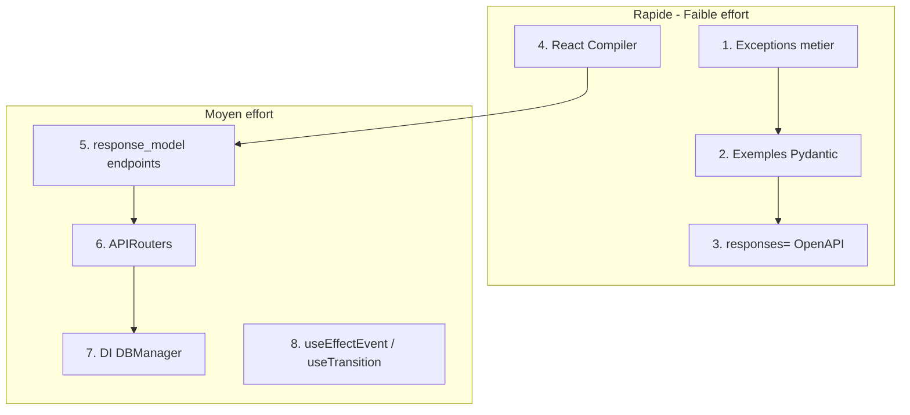

# Améliorations FastAPI et Frontend — Backlog 2026

**Statut** : Backlog
**Priorité** : Moyenne
**Référence** : [Auth0 FastAPI Best Practices](https://auth0.com/blog/fastapi-best-practices/), React 19.2, Pydantic v2
**Contexte** : api.py monolithique (~620 lignes), React 19.2.4, backend Pydantic partiel

---

## État actuel (audit mars 2026)

| Critère | Statut | Détail |
|---------|--------|--------|
| Pydantic entrée | Partiel | BatchSaveRequest validé, mais pas tous les endpoints |
| Pydantic sortie | Non | Aucun `response_model` sur les endpoints |
| React version | OK | 19.2.4 (>= 19.2 requis) |
| React Compiler | Non | Non activé |
| Keys dans .map() | OK | Utilisation de `id`, `_key`, `s.key` — pas d'index |
| useEvent/useEffectEvent | Non | Non utilisé (opportunité) |

---

## Partie 1 — Pydantic v2 : validation TOUTES entrées/sorties

> *"Utilisez Pydantic v2 pour valider TOUTES vos données d'entrée et de sortie. C'est votre première ligne de défense contre les données invalides."*

### 1.1 Ajouter `response_model` sur tous les endpoints

**Problème** : Les endpoints retournent des `dict` bruts sans validation. Une erreur de sérialisation (Decimal, date) peut fuiter ou provoquer 500.

**Solution** : Créer des schémas Pydantic pour chaque type de réponse et les déclarer :

```python
# backend/schemas/responses.py
class CatalogueResponse(BaseModel):
    products: list[ProductOut]
    next_cursor: str | None
    total: int

@app.get("/api/v1/catalogue", response_model=CatalogueResponse)
async def get_catalogue(...):
```

**Endpoints à couvrir** : catalogue, batch, fournisseurs, stats, history, price-history, compare, auth/me, community/stats, export, health.

**Effort** : Moyen
**Fichiers** : `api.py`, nouveau `backend/schemas/responses.py`

### 1.2 Valider les paramètres de requête avec Pydantic

Remplacer les paramètres dispersés par des modèles `Query` ou `Body` validés :

```python
class CatalogueQuery(BaseModel):
    famille: str | None = None
    fournisseur: str | None = None
    search: str | None = None
    limit: int = Field(default=50, ge=1, le=200)
    cursor: str | None = None
```

**Effort** : Faible
**Fichiers** : `api.py`, `backend/schemas/`

---

## Partie 2 — Backend FastAPI (Auth0 best practices)

### 2.1 Modulariser les routes (APIRouter)

Extraire de `api.py` vers :
- `backend/api/routes/invoices.py` : process, status
- `backend/api/routes/catalogue.py` : get, batch, fournisseurs, reset, price-history, compare
- `backend/api/routes/auth.py` : register, login, logout, me
- `backend/api/routes/community.py` : preferences, stats
- `backend/api/routes/misc.py` : export, vitals, health
- `backend/api/deps.py` : get_current_user, get_admin_user

**Effort** : Moyen
**Fichiers** : `api.py`, nouveau `backend/api/`

### 2.2 Injection DBManager et services via Depends

Remplacer le singleton `DBManager` par une injection :

```python
def get_db_manager(pool=Depends(get_pool)) -> DBManager:
    return DBManager(pool)
```

**Effort** : Moyen
**Fichiers** : `api.py`, `backend/core/db_manager.py`

### 2.3 Exceptions métier + handlers centralisés

Créer `DoclingException`, `JobNotFoundError`, `ProductNotFoundError`, etc. et des `@app.exception_handler` dédiés. Remplacer `raise HTTPException(...)` dans la couche service.

**Effort** : Faible
**Fichiers** : nouveau `backend/exceptions.py`, `api.py`

### 2.4 Exemples Pydantic pour OpenAPI

Ajouter `Field(..., examples=["..."])` sur `Product`, `BatchSaveRequest` pour enrichir `/docs`.

**Effort** : Faible
**Fichiers** : `backend/schemas/invoice.py`

### 2.5 Documentation `responses=` sur endpoints

Ajouter `responses={404: {...}, 500: {...}}` sur les endpoints critiques pour documenter les erreurs dans Swagger.

**Effort** : Faible
**Fichiers** : `api.py`

---

## Partie 3 — Frontend React 19 optimisations

### 3.1 Activer React Compiler

React Compiler 1.0 est stable (oct. 2025). Il optimise automatiquement les re-renders (memoization).

**Étapes** :
1. Installer `babel-plugin-react-compiler`
2. Configurer dans Vite (via `@vitejs/plugin-react` ou Babel)
3. Vérifier les règles ESLint `eslint-plugin-react-hooks` (preset `recommended-latest`)

**Effort** : Faible
**Fichiers** : `apps/pwa/vite.config.js`, `package.json`, `docling-pwa/`

### 3.2 Adopter useEffectEvent (React 19.2)

`useEffectEvent` stabilise les handlers dans les effets et évite les stale closures. Utile pour les effets avec callbacks (notifications, connexions).

**Exemple** :
```js
const onConnected = useEffectEvent(() => {
  showNotification('Connected!', theme);
});
useEffect(() => {
  const conn = createConnection(roomId);
  conn.on('connected', onConnected);
  // ...
}, [roomId]); // theme pas dans les deps
```

**Effort** : Faible (opportuniste)
**Fichiers** : Composants avec `useEffect` et callbacks (à auditer)

### 3.3 Concurrent Mode progressif

Utiliser `useTransition` ou `useDeferredValue` sur les routes/composants lourds (catalogue, comparaison de prix) pour garder l’UI réactive pendant les chargements.

**Effort** : Moyen
**Fichiers** : `CataloguePage`, `CompareModal`, `ScanPage`

### 3.4 Keys dans .map() — Déjà conforme

Audit : le projet utilise déjà des clés stables (`p.id`, `p._key`, `r.id`, `s.key`). Pas d’`index` comme `key`. Aucune action requise.

---

## Ordre d’exécution recommandé



---

## Références

- [Auth0 FastAPI Best Practices](https://auth0.com/blog/fastapi-best-practices/)
- [React Compiler v1.0](https://react.dev/blog/2025/10/07/react-compiler-1)
- [React useEffectEvent](https://react.dev/reference/react/useEffectEvent)
- [Pydantic v2](https://docs.pydantic.dev/latest/)

## Fichiers clés du projet

- [api.py](../../api.py)
- [backend/schemas/invoice.py](../../backend/schemas/invoice.py)
- [backend/core/db_manager.py](../../backend/core/db_manager.py)
- [apps/pwa/package.json](../../apps/pwa/package.json)
- [apps/pwa/vite.config.js](../../apps/pwa/vite.config.js)
